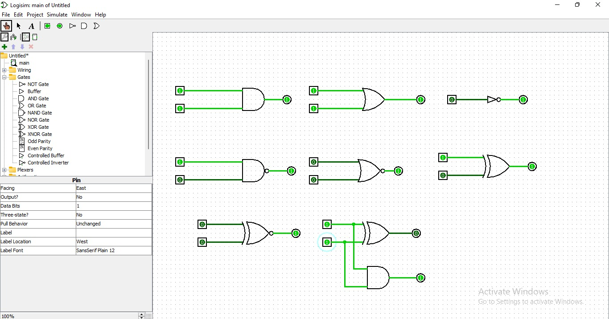

# VLSI-TASK1
# VLSI Logic Gate Simulation using Logisim

## Objective
This project demonstrates the simulation of basic digital logic gates and a Half Adder circuit using Logisim software. The task helps in understanding truth tables, logic operations, and combinational circuit design used in VLSI systems.

---

## Tools Used
- Logisim
- Digital Logic Gates
- Combinational Circuit Design

---

## Logic Gates Simulated
1. AND Gate
2. OR Gate
3. NOT Gate
4. NAND Gate
5. NOR Gate
6. XOR Gate

---

## Truth Tables

### AND Gate

| A | B | Output |
|---|---|--------|
| 0 | 0 | 0 |
| 0 | 1 | 0 |
| 1 | 0 | 0 |
| 1 | 1 | 1 |

### OR Gate

| A | B | Output |
|---|---|--------|
| 0 | 0 | 0 |
| 0 | 1 | 1 |
| 1 | 0 | 1 |
| 1 | 1 | 1 |

### NOT Gate

| A | Output |
|---|--------|
| 0 | 1 |
| 1 | 0 |

### NAND Gate

| A | B | Output |
|---|---|--------|
| 0 | 0 | 1 |
| 0 | 1 | 1 |
| 1 | 0 | 1 |
| 1 | 1 | 0 |

### NOR Gate

| A | B | Output |
|---|---|--------|
| 0 | 0 | 1 |
| 0 | 1 | 0 |
| 1 | 0 | 0 |
| 1 | 1 | 0 |

### XOR Gate

| A | B | Output |
|---|---|--------|
| 0 | 0 | 0 |
| 0 | 1 | 1 |
| 1 | 0 | 1 |
| 1 | 1 | 0 |

---

## Half Adder

Half Adder is a combinational circuit used to add two single-bit binary numbers.

### Equations
- Sum = A XOR B
- Carry = A AND B

### Half Adder Truth Table

| A | B | Sum | Carry |
|---|---|-----|-------|
| 0 | 0 | 0 | 0 |
| 0 | 1 | 1 | 0 |
| 1 | 0 | 1 | 0 |
| 1 | 1 | 0 | 1 |

---

## Simulation Screenshots

### Logic Gates Simulation

.
---

## Observations
- Verified outputs for all input combinations.
- Understood the behavior of logic gates.
- Learned Half Adder implementation using XOR and AND gates.
- Gained understanding of digital logic fundamentals in VLSI.

---

## Learning Outcomes
- Learned basics of VLSI design flow
- Understood digital logic gates
- Verified truth tables through simulation
- Built combinational circuits using Logisim

---

## Author
Nagireddy Manoj Sai Krishna
